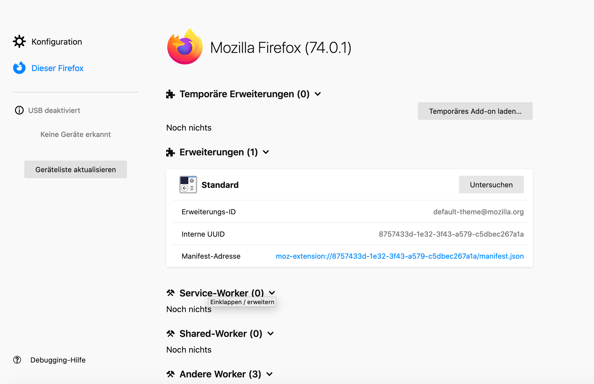
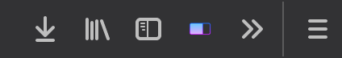

# Arachnet

## General Information

Arachnet is a tool which should give the user an overview of 
what is loaded in the background by the browser (only for Firefox). 
A lot of scripts, pictures or even fonts are loaded, some of which are only 
there to keep track of you.  
The current state of the add-on shows the number of found third-party 
domains and a list of the URLs called, as well as their types (script, image, font, etc.).

## Getting started 

To continue working on the project or to get a copy, you must first clone the project:

* Make sure you have Git installed 
* Open the console in the desired folder and enter: `git clone project-url`

### Requirements

* Firefox version >= 74 
* An editor with which you can work in JavaScript 

### Installation

* Open Firefox 
* In the search field enter `about:debugging`
* The page you have called up looks like this:

* On the left side you navigate to "This Firefox" 
* Click Load Add-on 
* Upload the manifest.json from the corresponding project 

## Running the tests

After you install the addon as a temporary addon, this button will appear:

If the button appears the addon was succesfully istalled.

## Authors 

* Lisa Hehr

## Acknowledgments

* Thanks to Lukas Beierle and Kevin Wieczorek for the cooperation
* Thanks to Lukas Beierle for the help with the README
* Thanks to our lecturer for the course "Datenschutz und Datensicherheit" Tobias Reimann
* The add-on name was defined and used within the course
* Open Source icons by icons8 
